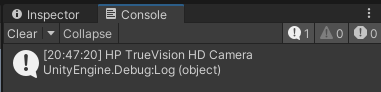
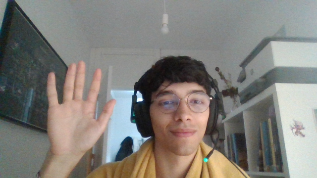

# Interfaces Inteligentes
## Práctica 8 - Micrófono y Cámara

- Ejercicio 1: El zombie reproduce un sonido cuando alcanza una araña.  
https://github.com/mluna22/InterfacesInteligentes_P8/assets/57454990/ae8d01be-b87f-44b2-83c2-b70885ead9e5

- Ejercicio 2: Mientras se mantiene pulsado R se graba el audio del micrófono, y al soltarlo se reproduce.  
https://github.com/mluna22/InterfacesInteligentes_P8/assets/57454990/56f27f83-e067-4bf1-a798-42062ea118d7

- Ejercicio 3: Se muestra el vídeo de la cámara en la pantalla, y se controla la reproducción con P.  
https://github.com/mluna22/InterfacesInteligentes_P8/assets/57454990/e0df2b6c-d2a1-4746-8c2c-0f427b48d662

- Ejercicio 4: Se muestra el nombre de la cámara en la consola.  
  
- Ejercicio 5: Se puede sacar captura de la cámara pulsando X. La siguiente imagen muestra una captura de la cámara hecha desde el programa.  
  
